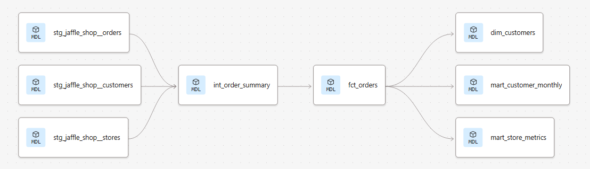
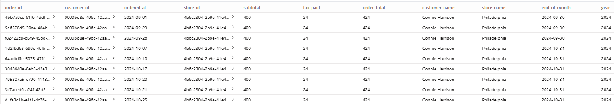
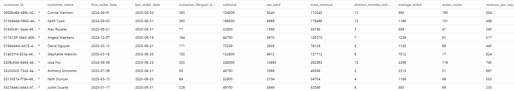
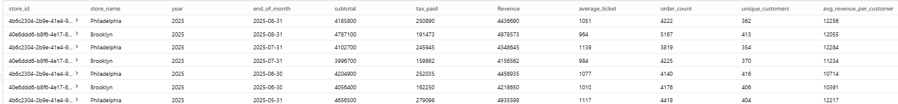

# The Jaffle Shop Analytics Project

## Overview
An analytics engineering project built with dbt Cloud and BigQuery, modeling ecommerce data across three layers:

- **Staging**: Cleans and renames raw source data
- **Intermediate**: Joins and reshapes staged data
- **Marts**: Delivers business-ready aggregations and metrics

## Data Source
Sample ecommerce dataset provided by dbt Labs (Jaffle Shop), loaded into BigQuery using dbt seeds.

## Models

### Staging
- `stg_jaffle_shop__orders` — Cleans and renames raw orders data
- `stg_jaffle_shop__customers` — Cleans and renames raw customers data
- `stg_jaffle_shop__stores` — Cleans and renames raw stores data

### Intermediate
- `int_order_summary` — Joins orders, customers, and stores into a single table

### Marts
- `fct_orders` — One row per order with all relevant dimensions
- `dim_customers` — One row per customer with lifetime metrics
- `mart_store_metrics` — Monthly revenue and order metrics by store
- `mart_customer_monthly` — Monthly order and spend metrics by customer

## Tech Stack
- **Transformation**: dbt Cloud
- **Warehouse**: Google BigQuery
- **Version Control**: GitHub

## Lineage

## Screenshots

### Lineage Graph

### fct_orders

### dim_customers

## Screenshots

### Lineage Graph

### fct_orders

### dim_customers

### mart_store_metrics
